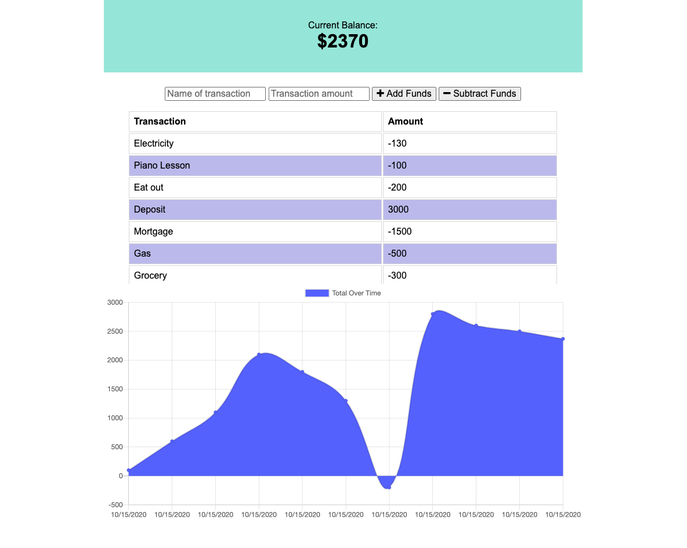

<h1 align="center">Welcome to My-Transaction-Tracker 👋</h1>

  
  
  
  

### 🏠 [Homepage](https://github.com/MK-Kwon/transaction-tracker#readme)

### ✨ [Demo](https://my-transaction-tracker-mk.herokuapp.com/)

### Deployed App: https://my-transaction-tracker-mk.herokuapp.com/

# My-Transaction-Tracker

> An online/offline Progressive Web App that tracks account balance, withdrawals, and deposits. It can be downloaded and used online or offline due to the inclusion of an app manifest and service worker. Data entered in offline mode is stored client-side in IndexedDB, then stored server-side in MongoDB once online again. The app also uses compression to optimize performance.

## Usage

1. Open URL https://my-transaction-tracker-mk.herokuapp.com/
2. Enter transaction name and amount to either Add or Subtract
3. A chart will appearl with the name and the amount of transaction 
4. Also a graph with "Total amount of funds over time" will appear
5. Users can access to the records both online and off-line. 

## Author

👤 **Min Kyung Kwon**

* Github: [@MK-Kwon](https://github.com/MK-Kwon)
* LinkedIn: [@min-kyung-kwon](https://linkedin.com/in/min-kyung-kwon)

## 🤝 Contributing

Contributions, issues and feature requests are welcome! Feel free to check [issues page](https://github.com/MK-Kwon/transaction-tracker/issues). You can also take a look at the [contributing guide](https://github.com/MK-Kwon/transaction-tracker/blob/master/CONTRIBUTING.md).

## Show your support

Give a ⭐️ if this project helped you!

## 📝 License

Copyright © 2020 [Min Kyung Kwon](https://github.com/MK-Kwon). 
This project is [ISC](https://github.com/MK-Kwon/transaction-tracker/blob/master/LICENSE) licensed.

***
_This README was generated with ❤️ by [readme-md-generator](https://github.com/kefranabg/readme-md-generator)_